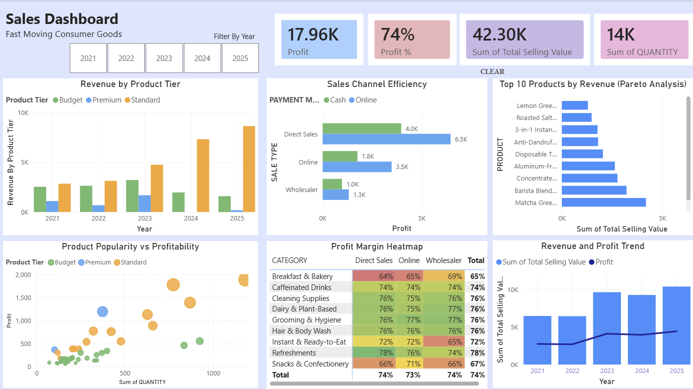
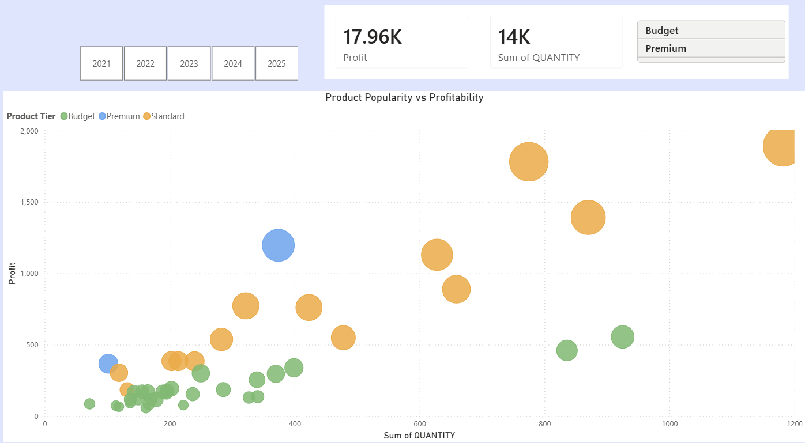
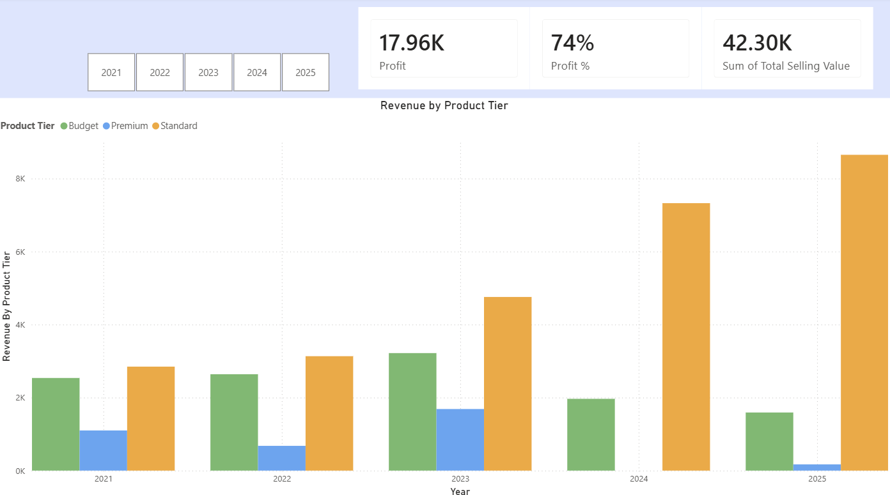
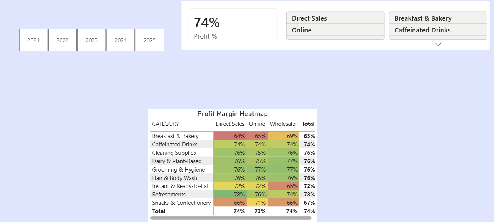

# FMCG Sales Performance Dashboard

## 📊 Project Overview

This project presents an interactive **Power BI dashboard** developed to analyse FMCG sales performance from **2021 to 2025**. Transactional sales data and product information were transformed into meaningful business insights related to revenue, profitability, product performance, sales channels and profit margins.

The dashboard enables users to explore business performance across different years, products, categories and sales channels, supporting more informed and data-driven decision-making.

---

## 🛠️ Tools & Technologies

* **Power BI** – Dashboard development and interactive data visualization
* **Power Query** – Data cleaning and transformation
* **DAX** – Measures and business calculations
* **Data Modelling** – Integration of transactional and product data
* **Microsoft Excel** – Source data management

---

## 🎯 Business Objectives

The dashboard was developed to:

* Evaluate overall revenue and profitability performance from 2021–2025
* Examine changes in revenue and profit over time
* Identify products that combine strong demand with strong profitability
* Evaluate revenue contribution across different product tiers
* Compare performance across different sales channels
* Identify the highest revenue-generating products
* Analyse profit margins across product categories and sales channels
* Translate analytical findings into actionable business insights

---

## 📈 Dashboard Overview



The main dashboard consolidates key performance indicators and business visualisations into a single interactive view.

Users can explore performance across the **2021–2025** period using dashboard filters and compare revenue, profitability, products and other dimensions of business performance.

---

## 🔍 Key Analyses

### 1. Product Popularity vs Profitability



The Product Popularity vs Profitability analysis evaluates the relationship between **product demand and financial performance**.

Product quantity sold is compared with profit at the individual product level, while total selling value provides an additional indication of revenue contribution. Products are also segmented according to their respective product tiers.

This analysis helps distinguish between:

* Products with both strong demand and strong profitability
* Popular products that generate comparatively weaker profits
* Profitable products with relatively lower sales volume
* Products that demonstrate weaker performance across both dimensions

This is useful because high sales volume alone does not necessarily indicate strong financial performance. Management can therefore evaluate products using both popularity and profitability when making product-related decisions.

---

### 2. Product Tier Analysis



The Product Tier Analysis groups products according to their pricing tiers and evaluates their contribution to business performance.

Segmenting products by tier allows management to understand whether revenue is concentrated among lower-priced, mid-range or higher-priced products.

This analysis can support decisions relating to:

* Product assortment
* Pricing strategy
* Inventory allocation
* Promotional priorities
* Product positioning

Rather than evaluating all products as a single group, tier-based analysis provides a clearer understanding of how different pricing segments contribute to overall performance.

---

### 3. Profit Margin Heatmap



The Profit Margin Heatmap compares **profit margin percentages across product categories and sales channels**.

The heatmap format enables differences in profitability to be identified quickly, helping users recognise category–channel combinations associated with stronger or weaker margins.

This analysis can support management in identifying:

* Higher-margin category and channel combinations
* Areas with comparatively weaker profitability
* Potential opportunities for channel optimisation
* Categories requiring further cost or pricing investigation

---

## 📊 Additional Dashboard Analyses

The Power BI report also includes several supporting analyses that provide a broader view of business performance.

### Revenue & Profit Trend

Revenue and profit are analysed across the **2021–2025** period to identify changes in overall financial performance over time.

Examining both measures together helps determine whether changes in revenue are accompanied by corresponding changes in profitability.

### Sales Channel Efficiency

Sales channel performance is compared to understand how different channels contribute to business results.

This analysis provides additional context for evaluating whether business performance differs according to how products are sold.

### Top 10 Products by Revenue

Products are ranked according to their revenue contribution to identify the strongest revenue-generating products.

This enables management to recognise important products and consider their role in inventory planning, promotion and product portfolio decisions.

---

## 🧹 Data Preparation & Transformation

Before developing the dashboard, the dataset was prepared and transformed using **Power Query**.

The data preparation process included:

* Reviewing the structure and quality of the source data
* Cleaning and standardising transactional records
* Assigning appropriate data types
* Preparing date fields for time-based analysis
* Integrating transactional sales data with product master information
* Establishing relationships between relevant tables
* Preparing product and category attributes for analysis
* Creating calculated measures for business performance evaluation

The transformation process ensured that the data was suitable for consistent and interactive analysis within Power BI.

---

## 🗂️ Data Model

The analysis combines two primary sources of business information:

**Transactional Data**

Contains information such as:

* Transaction date
* Product ID
* Quantity
* Sale type
* Payment mode
* Total selling value
* Total buying value

**Product Master Data**

Contains product-related information such as:

* Product name
* Product category
* Unit of measure
* Buying price
* Selling price

The relationship between transactional and product data enables sales performance to be analysed alongside product characteristics.

---

## 📐 Key Measures & Metrics

The dashboard uses DAX measures and aggregated transactional fields to evaluate business performance.

### Total Revenue

Represents the total selling value generated from sales transactions.

It is used to evaluate overall sales performance and compare revenue across products, product tiers, sales channels and time periods.

### Profit

Profit represents the difference between total selling value and total buying value.

```DAX
Profit =
SUM(InputData[Total Selling Value])
- SUM(InputData[Total Buying Value])
```

This measure enables profitability to respond dynamically to filters and different dimensions within the dashboard.

### Profit %

Profit percentage evaluates profitability relative to the total buying value.

```DAX
Profit % =
DIVIDE(
    [Profit],
    SUM(InputData[Total Buying Value])
)
```

This measure supports profitability comparison across categories, products and sales channels even when their absolute sales values differ.

### Total Quantity Sold

Quantity is aggregated to represent product demand and is particularly useful in the Product Popularity vs Profitability analysis.

Together, these measures allow the dashboard to evaluate business performance from both **sales and profitability perspectives**.

---

## 💡 Key Business Insights

### 1. Popularity and profitability should be evaluated together

Product demand and profitability represent different aspects of performance. A product with high sales volume does not automatically provide the strongest profit contribution.

The Product Popularity vs Profitability analysis therefore provides a more balanced approach to product evaluation by considering both dimensions simultaneously.

### 2. Product tiers provide additional insight into revenue performance

Grouping products according to pricing tiers makes it possible to understand how different price segments contribute to revenue.

This provides management with additional information when considering pricing, assortment and promotional strategies.

### 3. Profitability can vary across categories and sales channels

The Profit Margin Heatmap demonstrates the importance of analysing margins at a more detailed level rather than relying only on overall profit.

Differences between category–channel combinations can highlight areas where the business performs efficiently as well as areas that may require further investigation.

### 4. Revenue alone does not provide a complete picture of performance

Revenue measures sales generation, while profit and profit margin provide information about financial return.

Using these measures together provides a more comprehensive understanding of business performance than relying on revenue alone.

### 5. Time-based analysis provides context for business performance

Analysing revenue and profit across the 2021–2025 period enables changes in business performance to be viewed over time rather than as a single aggregated result.

This helps management distinguish longer-term performance patterns from individual-period results.

---

## 🎯 Business Recommendations

### 1. Prioritise products using both demand and profitability

Management should avoid evaluating products solely according to sales volume.

Products that combine strong demand with strong profitability can be prioritised for inventory availability, marketing support and product portfolio planning.

Products with high demand but weaker profitability should be reviewed to determine whether pricing, costs or promotional strategies can be improved.

### 2. Use product-tier performance to support pricing decisions

Revenue contribution across product tiers should be monitored to understand customer purchasing behaviour across different price segments.

This information can support decisions regarding product positioning, assortment and promotional strategies.

### 3. Monitor category and channel margins regularly

Category–channel combinations with comparatively weaker profit margins should be investigated further.

Management can examine potential causes such as product costs, selling prices, channel-related expenses or product mix before determining appropriate actions.

### 4. Protect the performance of key revenue-generating products

Products appearing consistently among the strongest revenue contributors should receive appropriate attention in inventory planning.

Maintaining product availability can reduce the risk of losing sales from products that make an important contribution to overall revenue.

### 5. Evaluate revenue and profit together over time

Management should monitor whether revenue growth is accompanied by sustainable profit performance.

Increasing revenue without corresponding profitability improvements may indicate rising costs, an unfavourable product mix or other operational issues requiring further investigation.

---

## 💼 Skills Demonstrated

This project demonstrates practical experience in:

* Power BI Dashboard Development
* Power Query
* DAX
* Data Cleaning
* Data Transformation
* Data Modelling
* Data Visualization
* Business Intelligence
* KPI Development
* Product Performance Analysis
* Profitability Analysis
* Trend Analysis
* Business Insight Generation
* Data-Driven Decision-Making

---

## 📚 What I Learned

This project strengthened my understanding of the **end-to-end business intelligence workflow**, from preparing and modelling raw business data to developing DAX measures, designing interactive visualisations and interpreting analytical results.

It also reinforced the importance of looking beyond individual metrics. Revenue, profitability, product demand, margins and time-based trends provide different perspectives on business performance and are more valuable when analysed together.

Most importantly, the project strengthened my ability to translate data and visualisations into **business insights and recommendations**, rather than treating dashboard development as a purely technical exercise.

---

## 👤 Author

**Paul Lim Yi Xuan**
Bachelor of Business Analytics
Tunku Abdul Rahman University of Management and Technology

**Tools:** Power BI | Tableau | SQL | Python | SPSS
